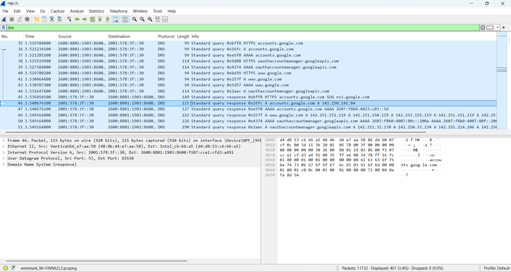
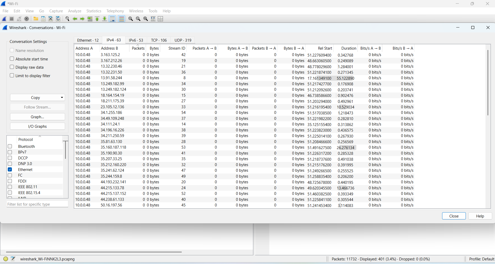
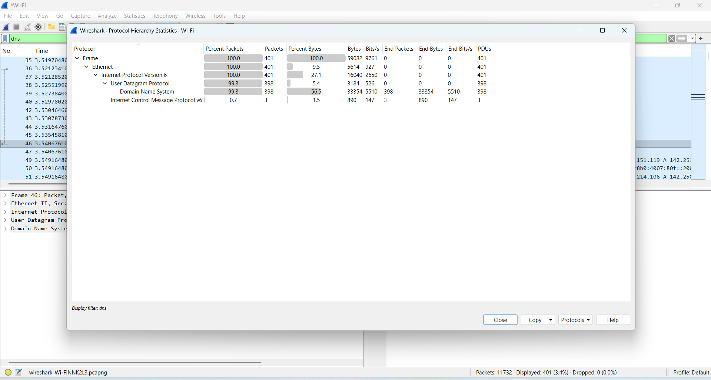

# wireshark-network-analysis
Wireshark network traffic analysis investigating DNS queries, IP conversations, and protocol hierarchy.
## Investigation Screenshots

### DNS Query Investigation

This screenshot shows DNS traffic captured in Wireshark while resolving Google domains.
The system performs a DNS lookup for accounts.google.com and receives a valid response.
The response resolves the domain to the IP address 142.250.141.84, confirming successful domain name resolution.

### Network Conversations

The Conversations view in Wireshark shows communication between the local host and external IP addresses.
This allows analysts to quickly identify which remote systems are communicating with the device.
Sorting conversations by packet count helps identify unusual or suspicious traffic patterns.

### Protocol Hierarchy

The Protocol Hierarchy Statistics window provides a breakdown of the protocols observed in the capture.
The traffic mainly consists of DNS queries using UDP over IPv6.
This indicates normal network activity related to domain name resolution.
